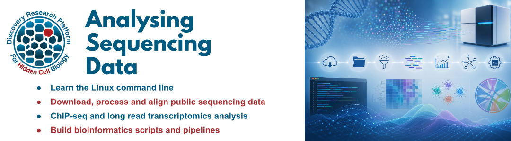

------------------------------------------------------------------------

This is the homepage for **Analysing Sequencing Data** hosted by the [DRP-HCB Bioinformatics Core](https://drp-hcb-bioinformatics.github.io/DRP-HCB-Bioinformatics/) at the University of Edinburgh.

These courses are run annually by the Bioinformatics Core but are also available upon request.

 

{fig-align="center" width="2200"}

## Course content

- [Lesson 1: Bioinformatics on the Linux command line]()
- [Lesson 2: High throughput sequencing data]()
- [Lesson 3: Analysing HTS data (ChIP-seq example)]()
- [Lesson 4: Long read transcriptomics]()
- [Lesson 5: Building bioinformatics pipelines (bash scripts and Snakemake)]()

------------------------------------------------------------------------

For more information contact [Shaun Webb](mailto:shaun.webb@ed.ac.uk).
